# 💖 Loveliz App – Solução Mobile para Gestão de Moda Feminina

Loveliz App é um aplicativo mobile desenvolvido sob medida para a loja de moda feminina Loveliz, com foco total em gestão eficiente, análise de vendas e uma experiência de usuário moderna. Criado com Flutter no front, Node.js + TypeScript no backend e Python + LangChain para inteligência artificial, o app entrega performance, interatividade e insights valiosos!

## 🚀 Funcionalidades
📊 Dashboard Inteligente 
  - Total vendido

  - Quantidade de produtos vendidos

  - Produto mais vendido

  - Vendas mais recentes

Tudo isso apresentado de forma clara e visual para facilitar a tomada de decisões.

## 🔐 Autenticação e Controle de Acesso
O app conta com um sistema de autenticação segura baseada em JWT (JSON Web Tokens) para proteger todas as rotas sensíveis da API.

   -  Login com autenticação JWT

   - Middleware de proteção nas rotas, garantindo acesso apenas a usuários autenticados

   -  Controle de permissões por perfil:

   - Admin: acesso total (produtos, coleções, vendas, relatórios, usuários)

   - Vendedor: acesso controlado (vendas e visualização de produtos)

   - Validação e renovação de tokens para manter a sessão segura e estável

## 👗 Gestão de Produtos e Coleções
   - CRUD completo para coleções de produtos

   - CRUD completo para produtos

   - Produtos organizados por coleções para melhor navegação e controle

 ## 💸 Módulo de Vendas
   - Lista de vendas exibida por cards

   - Detalhes como: valor da venda, data, forma de pagamento e código de venda
   - Leitura de QR Code: escaneie o código de um produto e seja automaticamente direcionado à tela de venda, com nome, modelo, preço e cor já preenchidos

   - Banco de dados local: o app funciona mesmo offline, garantindo que você possa continuar vendendo sem internet, com sincronização futura quando a conexão for restabelecida

 ## 📈 Relatórios Interativos
   - Visualização de dados com gráficos dinâmicos:

   - Vendas por mês

   - Vendas por produto

   - Vendas por forma de pagamento

   - Crescimento de vendas
     
   - Vendas por vendedores

   - Comparativos

   - Os gráficos são totalmente interativos, entregando uma experiência de análise fluida e visualmente rica.

## 🤖 Assistente com IA (LLM)
   - Implementado com um Floating Action Button (FAB) que abre um chat interativo com animações tipo efeito de digitação e seleção de tópicos:

   - Tópicos disponíveis:

   - 📌 Insights

   - 📈 Estratégias

   - 🌍 Tendências

   - Cada tópico oferece perguntas específicas, e ao clicar em uma delas, é feita uma requisição para uma API em Python + Flask que integra o LangChain, acessa os dados de vendas em tempo real e retorna respostas em linguagem natural. É literalmente ter uma assistente de BI no seu bolso!

## 🛠️ Tecnologias Utilizadas
| Camada       | Tecnologias                                |
|--------------|---------------------------------------------|
| Frontend     | Flutter                                     |
| Backend      | Node.js, TypeScript, Fastify                |
| Inteligência | Python, LangChain, Flask                    |
| Gráficos     | fl_chart (Flutter)                          |
| Integração   | API RESTful entre Node.js ↔ Python ↔ Flutter |

### 📸 Screenshots
#### Login

  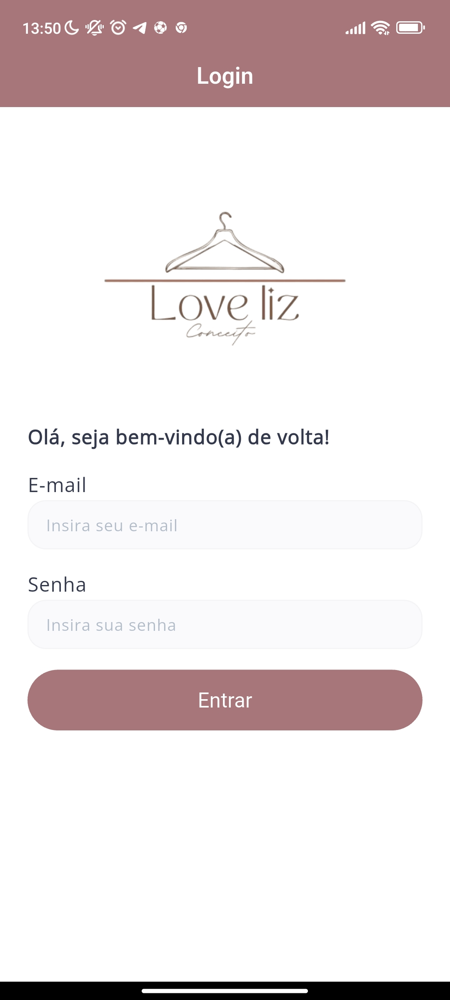

#### Dashboard

  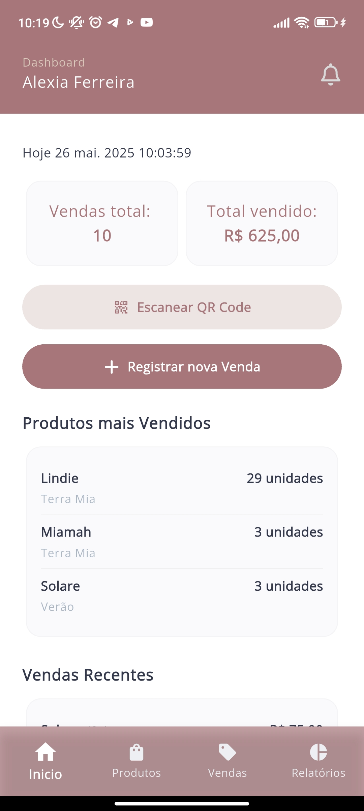
  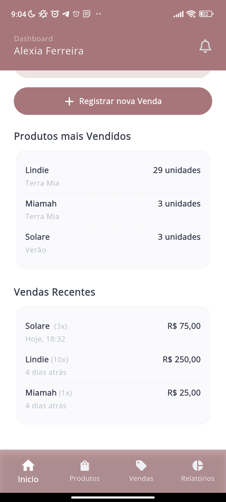

#### Produtos

  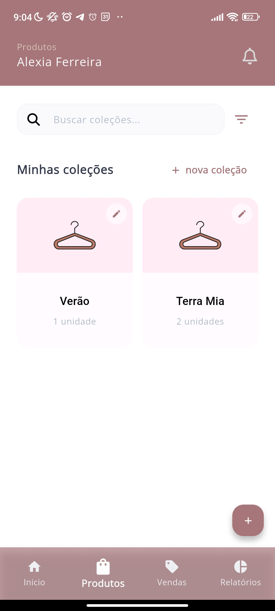
  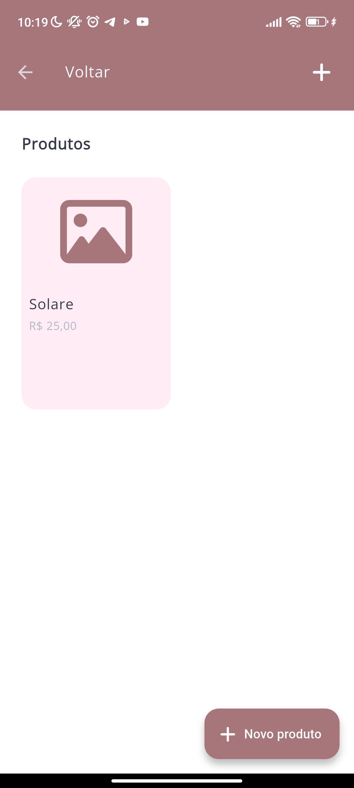
   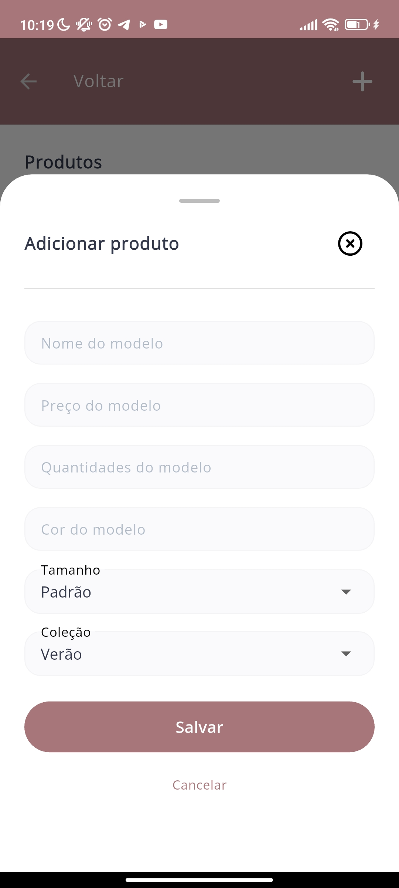

#### Vendas

  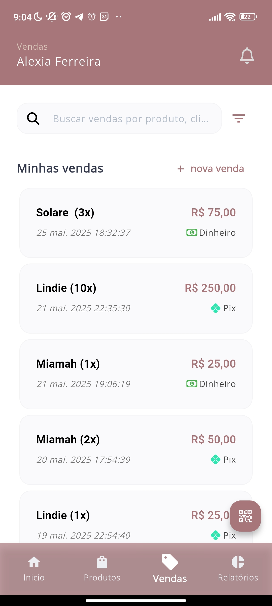
  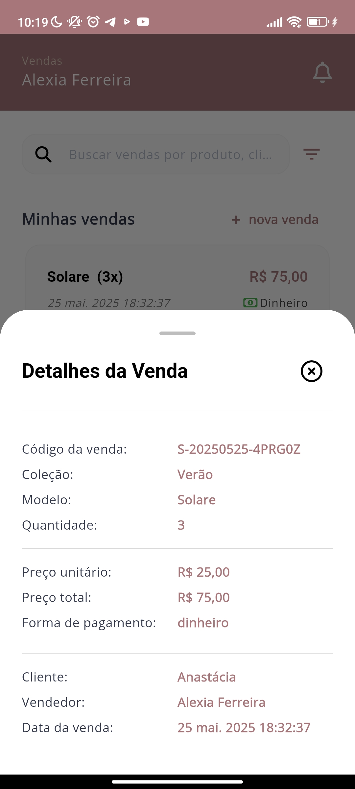

#### Relatórios

  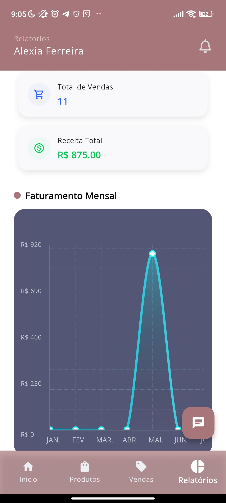
  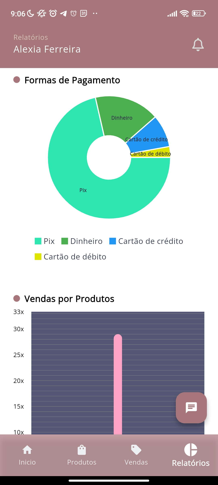
  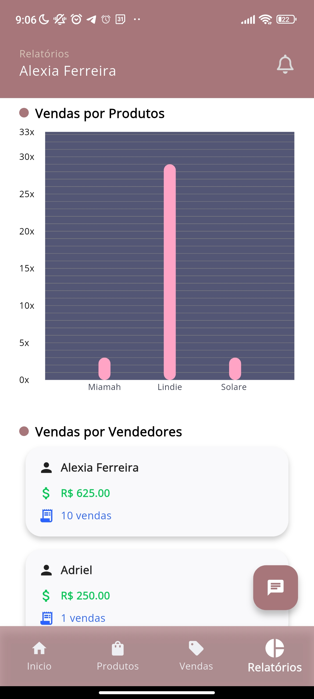

#### Assistente Virtual (IA)

  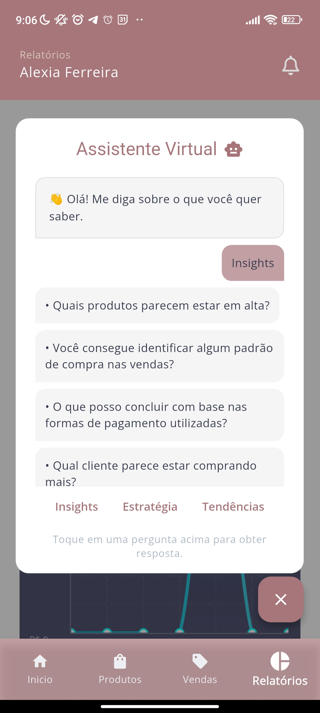
  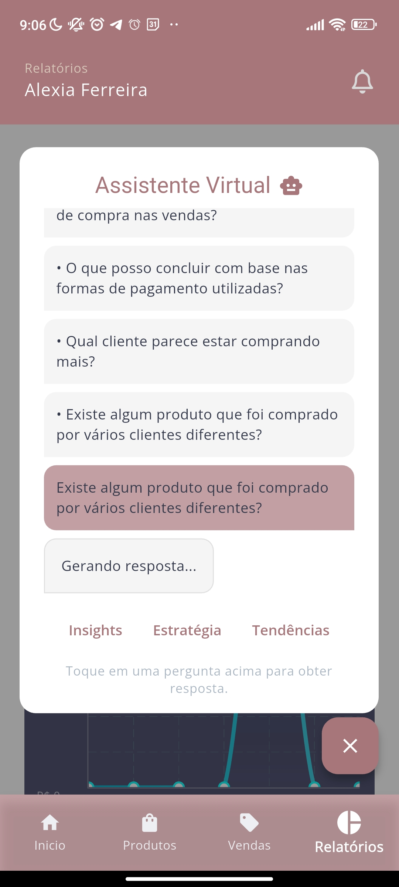
  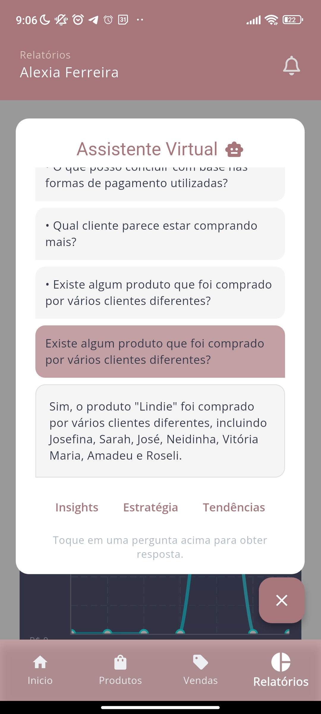

